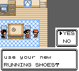
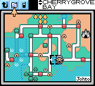
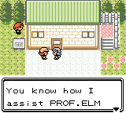
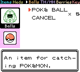
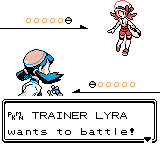
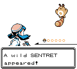
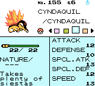
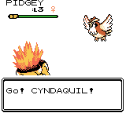

# POKéMON POLISHED CRYSTAL

This is a modification of the [Pokémon Polished Crystal ROM Hack](https://github.com/Rangi42/polishedcrystal) by [rangi](https://github.com/Rangi42).
It's essentially the exact same game, but names have been restored to the Gen 2 naming convention.
This means that Pokémon names, characters, locations, items, stats, and some other words have been changed to ALL CAPS.
Here's a few examples (original Polished Crystal on the left, this version on the right):

  
 

The original Polished Crystal README is below, minus the screenshots section.

# Original README
This is a custom Pokémon game based on [the Pokémon Crystal disassembly](https://github.com/pret/pokecrystal).

My goal is to create what the title says: an improved, polished version of Pokémon Crystal. It fixes bugs, takes into account the official game changes since 2001, and adds some new ideas of my own. Many features restore what was removed from R/B/Y, or original to HG/SS.

I've had vague plans to make a Pokémon game for years. I'm very impressed by the effort that's gone into disassembling Pokémon Crystal and making the code so well-organized. Thanks to making it open-source (and to the ROM hackers that inspired me), I'm finally making this game a reality.

> There are many ways to create games but the way we work at Game Freak may be a little different from other companies. That is, we constantly change and tweak what we have come up with. To make a fun game even more fun and polish it up, we take what we have made and start thinking about it from scratch. And to make the game the most fun to play we make endless changes and tweaks no matter how long it takes. It may not be the best way, but I think these tweaks are important to make our games fun and better.
>
> — Junichi Masuda, "[HIDDEN POWER of masuda No. 7](https://www.gamefreak.co.jp/blog/dir_english/?p=21)"

## Download and Play

The current beta version is **3.0.0**. It has some incomplete original content and known bugs, but it's playable from start to finish. Download the [nightly release](https://github.com/Rangi42/polishedcrystal/releases/tag/v3.0.0-beta) to get the very latest ROM, up-to-date with the `master` code branch.

The most recent official version is [2.2.0](https://github.com/Rangi42/polishedcrystal/releases/tag/v2.2.0) as of September 20, 2016. [The changelog](CHANGELOG.md) lists all changes since then. I recommend playing the 3.0.0 beta instead.

If you want to do a [Nuzlocke Challenge](http://bulbapedia.bulbagarden.net/wiki/Nuzlocke_Challenge), check out Nuzlocke mode in the Option menu!

*If you have any questions about these steps, [read the FAQ](FAQ.md)!*

## Features

A full list of features is in [FEATURES.md](FEATURES.md). Features new to the beta are in [CHANGELOG.md](CHANGELOG.md). Some highlights:

* 253 Pokémon, including some new evolutions.
* 48 new moves.
* 65 TMs and 21 move tutors.
* Many new mechanics, including the Fairy type, Physical/Special split, Natures, unlimited TMs, Running Shoes, and continuous Repel.
* New maps: some restored from R/B/Y, some devamped from HG/SS, and some original.
* New characters, including Lorelei and Agatha from R/B/Y, Lyra and the Team Rocket Executives from HG/SS, and others.
* More post-game content, like Gym Leader rematches and an event after the battle with Red.
* An improved level curve with steadily increasing challenges throughout the game.
* Music and graphics devamped from other versions.
* Nuzlocke mode in the Option menu, enabling the basic rules of the [Nuzlocke Challenge](http://bulbapedia.bulbagarden.net/wiki/Nuzlocke_Challenge).

## Discussion

You can post questions or comments on any of these sites. But please read the [FAQ](FAQ.md) first if you have a question.

* [Discord](https://discord.gg/ZK5pqK8)
* [Skeetendo](https://hax.iimarckus.org/topic/6874/)
* [PokéCommunity](http://www.pokecommunity.com/showthread.php?t=373172)
* [Romhack.me](http://www.romhack.me/polishedcrystal/wall/)
* [/r/PokemonROMHacks](https://www.reddit.com/r/PokemonROMhacks/comments/51kbcn/pok%C3%A9mon_polished_crystal_200/)
* [Nuzlocke Forums](http://s7.zetaboards.com/Nuzlocke_Forum/topic/11003710/)
* [Pokémon Hackers Online](http://www.pokemonhackersonline.com/showthread.php?t=15811)